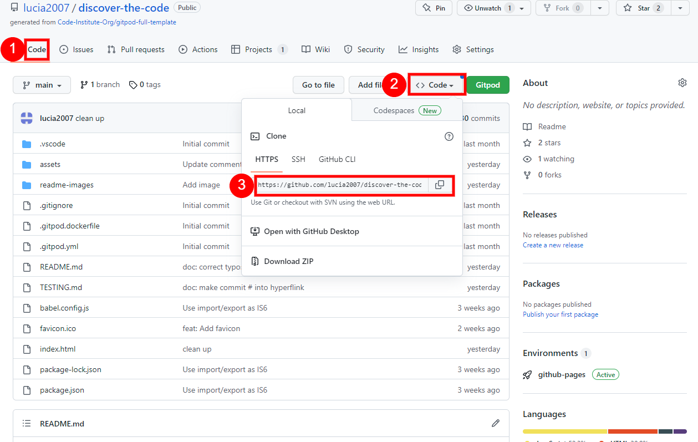

# Discover the Code

The purpose of this website is to allow a user to play a logical game/puzzle which is fun and straightforward. Guessing the secret code is not easy, so the user needs to be determined and willing to think hard. This app was inspired by a game called <a href="https://www.amazon.co.uk/MengTing-Mastermind-Classical-Cracking-Intelligent/dp/B06X9LLWTS/ref=asc_df_B06X9LLWTS/?tag=googshopuk-21&linkCode=df0&hvadid=310776459020&hvpos=&hvnetw=g&hvrand=2074715707490516415&hvpone=&hvptwo=&hvqmt=&hvdev=c&hvdvcmdl=&hvlocint=&hvlocphy=1007850&hvtargid=pla-358744999429&psc=1" target="blank" rel="noopener">Mastermind</a> which is widely known. This game can be played in a relatively short time and it is an ideal pass time when waiting at a doctors office or when commuting.

The site is targeted towards people who like to strech their mind and improve their logical skills. The current version of the game is targeted at adults or those users who are not easily dissuaded.

In the future versions I would like to add levels so a wider audience can enjoy this game.

Discover the Code is useful for all users who want to be entertained and at the same time work on their logical skills.

<a href="https://lucia2007.github.io/discover-the-code/index.html" target="_blank" rel="noopener">Discover the Code</a>

<!--  --> 

# Contents

- [Discover the Code](#discover-the-code)
- [Contents](#contents)
- [User Experience](#user-experience)
  - [User Experience (UX)](#user-experience-ux)
    - [**User Stories**](#user-stories)
    - [**Primary Goal**](#primary-goal)
    - [**Visitor Goals**](#visitor-goals)
    - [**First Time Visitor**](#first-time-visitor)
    - [**Returning Visitor**](#returning-visitor)
    - [**Frequent Visitor**](#frequent-visitor)
  - [Dependency diagram](#dependency-diagram)
  - [Wireframes](#wireframes)
  - [Site Structure](#site-structure)
  - [Design Choices](#design-choices)
- [Features](#features)
  - [Home Page](#home-page)
    - [Header](#header)
    - [Welcome message](#welcome-message)
    - [Scores](#scores)
    - [Playground](#playground)
    - [Pick Your Color](#pick-your-color)
    - [Winning message](#winning-message)
    - [Losing message](#losing-message)
    - [Test Driven Development](#test-driven-development)
    - [Future Features](#future-features)
- [Technologies Used](#technologies-used)
- [Testing](#testing)
- [Deployment](#deployment)
  - [**Project Deployment**](#project-deployment)
  - [**To fork the repository on GitHub**](#to-fork-the-repository-on-github)
  - [**To create a local clone of a project**](#to-create-a-local-clone-of-a-project)
- [Credits](#credits)
  - [Content](#content)
  - [Media](#media)
  - [Acknowledgements](#acknowledgements)

# User Experience

## User Experience (UX)

### **User Stories**

### **Primary Goal**

Discover The Code game/puzzle is inspired by the game of <a href="https://www.amazon.co.uk/MengTing-Mastermind-Classical-Cracking-Intelligent/dp/B06X9LLWTS/ref=asc_df_B06X9LLWTS/?tag=googshopuk-21&linkCode=df0&hvadid=310776459020&hvpos=&hvnetw=g&hvrand=2074715707490516415&hvpone=&hvptwo=&hvqmt=&hvdev=c&hvdvcmdl=&hvlocint=&hvlocphy=1007850&hvtargid=pla-358744999429&psc=1" target="blank" rel="noopener">Mastermind</a>. The game is suitable for anyone who is not afraid of being challenged, perhaps stuck and likes to think hard to figure out the solution.

### **Visitor Goals**

Discover The Code game has been designed to be straightforward, with minimalist and yet attractive design. The current version is aimed at people who enjoy puzzles and challenges so they can put their logical skills to test. The player can play deep focus music which helps the user to relax and think deeply. The game is responses to different media screen sizes, but at the same time the design is kept uniform accross different devices. A stopwatch and the moves counter measure the user's progress.

### **First Time Visitor**

  - A user can find the game rules in a modal window.
  - A user can start the game by pressing a Play button.
  - A user can turn on and off the deep focus music.
  - A user can display and hide the rules in case they need to be reminded of them by clicking on the question mark icon.
  - A user can click on the colors in the Color Picker to assign them to the current guess row.
  - A user can change a previously chosen color in the current guess row by clicking on it and thus deleting it. Then the user can proceed to choose a different one.
  - A user can see the timer start when they have made their first color choice.
  - A user can see the moves counter update after a Check button has been pressed.
  - A user can see the stopwatch stop when the last unsuccessful guess is checked or when a winning messages is displayed in case of a win.
  - A user can expect the scores to be displayed in the winning modal window.
  - A user can choose to Play again after they have won or lost, or choose to close the modal and look at the playground board more closely again.
  - A user can reset the game by clicking a reset button.
  

### **Returning Visitor**

  - A user is familiar with the rules and can start the game by clicking the Play button.
  - A user can choose to play the deep focus music.

### **Frequent Visitor**

  - A user can try to beat their time or score. (This feature to be included in future versions.)

---

## Dependency diagram

As the game of Mastermind is quite complex, I began by creating [a dependency diagram](https://www.figma.com/file/QEIjBXsR941WeLv8P5d6R9/Dependency-graph?node-id=0%3A1&t=tmvBBQln2l3eHZIf-0) to help me organize/plan the flow of the game. This was extremely useful especially in moments, when it was not clear were a certain function or feature belonged what the dependencies were or with what should be tackled next. I started by working on the HTML and the most basic functionalities, adding complexity and new features as I went along, finishing by adding "nice-to-have" features like adding an option to play deep focus music.

When I was working on the logical part of the game, I was encouraged by my husband, who is an IT engineer, to apply TDD (test driven development) to make sure my scoring system worked correctly (assets/js/logic.test.js). It was a great relief not to have to worry about this part of the app in the later stages, when I could just rely on the fact that the logic had been thoroughly tested and worked seamlessly.

## Wireframes

The wireframes were created in [Figma](https://figma.com). Originally I intended to make the app very colorful, but later I opted for a cleaner look. Also at first I thought I would do a different layout for the desktop with the rules on the right, but in the end I opted for a uniform look across different devices and screen widths.

In comparison with the original design, I changed the look of the sercret row and instead of question marks I used images of keys. Instead of a toggle I used a music not icon to make it clear what this button was intended for.

[Wireframes for all devices](./readme-images/wireframes.png)

[Back to top](#contents)

## Site Structure

Discover the Code app contains only one page to keep the app simple.

[Back to top](#contents)

## Design Choices

- ### Typography

  "Noto Sans", weight 300, 400 and 700 were downloaded originally, but only the regular weight is being used throughout the app. The font is easily legible. The chosen font was downloaded from [Google Fonts](https://fonts.google.com/).

- ### Color Scheme
  <!-- The chosen color scheme reflects the colors most often seen on tennis courts: green, orange, blue. The complementary colors were chosen using [Color pallete generator](coolors.co). -->

<!--  -->

[Back to top](#contents)

# Features

## Home Page

### Header

 <!-- change the image>

- The header firstly contains the name of the game which should intice the user to want to try to decode the secret sequence of colors

- The second row contains five squares with keys in them which imply a secret to be guessed.

- The music note icon allows the user to turn on and off deep focus music.

- The question mark icon works as a toggle and displays or hides the welcome message which contains the rules of the game

[Back to top](#contents)

### Welcome message

 <!-- change the image>

As soon as the page is loaded, a welcome message is displayed. In the welcome message the rules and the clues are explained. When a Play button is clicked, the modal is hidden and the plaground and the rest of the features are displayed.

### Scores

 <!-- change the image>

This section displays the time the user needed to guess the code and also how many attempts were used. 

The timer starts as soon as the user clicks on any of the squares in the Pick You Color section. The timer stops when the secret code is guessed or when the user used all 12 attempts and has not guessed the code.

[Back to top](#contents)

### Playground

 <!-- change the image>

The playground section contains 12 rows of 5 squares and 5 circles next to each other. The squares are used for guessing the code, the circles display the clues after the Check button is clicked.

[Back to top](#contents)

### Pick Your Color

In this section there are eight colors from which the user can choose. Colors can be used repeatedly. The user clicks on a color he wants to use and the color is assigned to the first square on the left in the last/bottom row. The next color will fill the next square to the right and so on until five colors are chosen.

<!-- Future feature: When the user is unhappy with his color choice, he can click on the square the color of which he would like to change, the square turns back to grey and lets the user choose a different color. -->

As soon as five colors are chosen, the Check button is enabled and the user can see the clues displayed in the set of five circles next to the row of squares which was currently used.

- Black circle - you guessed a color, and its position
- White circle - you guessed a color, but not its position
- Grey circle - wrong color was chosen

[Back to top](#contents)

### Winning message

 <!-- change the image>

When the user manages to guess all the five colors in their correct order within the 12 attempts a winning message pops up accompanied by a winning chime. In the winning message the user can see how much time it took him to guess the code and how many attempts he/she needed. At the same time as the message is displayed, the secret row is revealed and the user can compare his guess to the secret code. At the end of the pop up message the user gets a choice to play again or to hide the winning message. When the user chooses the Play again option, the pop up is closed and the game is reset to the intial settings. When he chooses to close the modal, he can look more closely at his choices.

[Back to top](#contents)

### Losing message

 <!--change the image>

If the user does not manage to guess the correct color sequence in the 12 attempts, a losing message is displayed. At the same time a "game-over" chime is played and the user is commiserated on his lack of success. The secret code is revealed so the user can see where he made a mistake. At the end, the user has an option to play again or close the message.

[Back to top](#contents)

### Test Driven Development

[Back to top](#contents)

### Future Features

- This game could have different levels depending on the age or self-confidence of the players. 
  - To make the game easier, I could forbid the repetion of colors or decrease the number of colors. In the easier version the position of the clues could correspond to the individual color choices.
  - To make the game more challenging, even more colors could be made available in the color picker or perhaps I could construct a countdown timer to put the player under pressure.

[Back to top](#contents)

# Technologies Used

- [HTML5](https://html.spec.whatwg.org/) - provided the structure and content for the website
- [CSS](https://www.w3.org/Style/CSS/Overview.en.html) - enabled applying own styles and design
- [Figma](https://figma.com/wireframes/) - used for creating the wireframes
- [Gitpod](https://www.gitpod.io/#get-started) - used for deploying the website
- [Github](https://github.com/) - used for hosting and editing the website
- [Favicon converter](https://favicon.io/favicon-converter/)
- [JavaScript]() <!-- Add a link>

[Back to top](#contents)

# Testing

For detailed results of all the tests conducted, please refer to this [_file_](TESTING.md).

[Back to top](#contents)

# Deployment

## **Project Deployment**

The site was deployed to GitHub pages. In order to deploy, the following steps were taken:

1. Navigate to the **Settings** tab in the GitHub repository.
2. When in **Settings**, navigate to the **Pages** tab below the middle of the list on the left hand side.
3. From the **Branch** drop-down menu select the option **main**, then click **save**.
4. After the main branch has been selected and confirmed, the page will be automatically refreshed. The refresh might take several minutes. A detailed message will appear at the top of the page indicating the successful deployment. The message will include a link to the deployed site.

The link to the the live site can be found here - https://lucia2007.github.io/tennis-for-all/

[Back to top](#contents)

## **To fork the repository on GitHub**

A copy of the GitHub Repository can be made by forking the GitHub account. This copy can be viewed and changed without affecting the original repository. Take the following steps to fork the repository:

1. Log in to **GitHub** and locate the [repository](https://github.com/lucia2007/tennis-for-all).
2. On the top right hand side of the page is a button called **'Fork'**. Click on the button to create a copy of the original repository in your GitHub Account.

[Back to top](#contents)

## **To create a local clone of a project**

Take the following steps to create a clone of a project:

1. Click on the **Code** button in the left top corner.
2. Next to the green **GitPod** button, click on **Code** drop-down menu.
3. In the **HTTPS** section, click on the clipboard icon to copy the displayed URL.
4. In your IDE of choice, open **Git Bash**.
5. Change the current working directory to the location where you want the cloned directory to be made.
6. Type **git clone**, and then paste the URL copied from GitHub.
7. Press **enter** and the local clone will be created.

[Back to top](#contents)

# Credits

## Content

- The overall inspiration came from the well-known game called <a href="https://www.amazon.co.uk/MengTing-Mastermind-Classical-Cracking-Intelligent/dp/B06X9LLWTS/ref=asc_df_B06X9LLWTS/?tag=googshopuk-21&linkCode=df0&hvadid=310776459020&hvpos=&hvnetw=g&hvrand=2074715707490516415&hvpone=&hvptwo=&hvqmt=&hvdev=c&hvdvcmdl=&hvlocint=&hvlocphy=1007850&hvtargid=pla-358744999429&psc=1" target="blank" rel="noopener">Mastermind</a> which I used to love to play as a child. In the postcommunist countries this game was called Logik.
- The fonts were downloaded from [Google Fonts](https://fonts.google.com/).
- [Figma](https://figma.com/) was used to create the wireframes and the dependency diagram.
- The framework for the readme file was originally taken from [Wawas Wood](https://github.com/EwanColquhoun/wawaswoods/blob/master/README.md) and from [Scoops](https://github.com/amylour/scoops_pp1/blob/main/README.md#testing).

## Media

- The icons were found at [Font Awesome](https://fontawesome.com/), [Free Icons](https://www.freeiconspng.com), [PNG ARTS](https://www.pngarts.com/), [The Noun Project](https://thenounproject.com/) and [Flat Icon](https://www.flaticon.com/).
- Winning and losing chimes were downloaded [here](https://www.dropbox.com/s/mbmhocwo4bbdsgp/Correct%20Answer.mp3?dl=0), and [here](https://www.dropbox.com/s/kulc9u7r69d8odl/Wrong%2002.wav?dl=0).
- Focus music was downloaded [here](https://www.chosic.com/free-music/study/). 
<!-- - The photos were compressed using the [Squoosh app](https://squoosh.app//). -->

## Acknowledgements

- Extra help and guidance was received from my mentor Precious Ijege, from my husband Sam and fellow colleagues from the Code Institute.
- My husband Sam encouraged me to try the test driven development for the logical part of the game and guided me through it. He also helped me by installing the necessary packages and with the import of the logic.js file.
- I used several tutorial for different features:
  - This [tutorial](https://www.youtube.com/watch?v=wffK2OIt8u0) was used to help me turn on and turn off the deep focus music when the music icon is pressed.
  - I used this [tutorial](https://foolishdeveloper.com/create-a-simple-stopwatch-using-javascript-tutorial-code/) to help me set up the timer/stopwatch.
  - I used these [instructions](https://bobbyhadz.com/blog/javascript-get-object-key-by-value) to get the object key by value for a helping function when I wanted to reveal the secret code in console.log so I could test the features more quickly.
  - The following [tutorial](https://www.youtube.com/watch?v=IFoG8-oAELM) helped me with setting up the pop up modals.
  - The playground structure was inspired by this [project](https://github.com/LudovicLeGuen/Mastermind).
  - I also got inspiration for the button handlers from the [Love Maths Project](https://learn.codeinstitute.net/courses/course-v1:CodeInstitute+LM101+2021_T1/courseware/2d651bf3f23e48aeb9b9218871912b2e/78f3c10a937c4fe09640c7c0098d16bd/)

Thank you all for your support and encouragement. I couldn't have done it without you.

[Back to top](#contents)